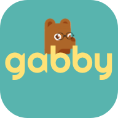
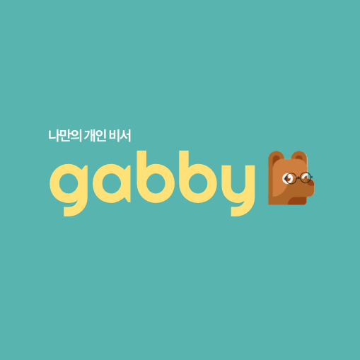

# gabby

## 처음부터 끝까지, 기획부터 디자인, 개발까지 혼자 해보는 리액트 IOS 어플 개발
- 왜 IOS 만? 내가 아이폰이기 때문. 안드로이드 테스팅 귀찮구 그만 고통받구파
- 디자인 잘하구 싶다. 혼자 처음부터 다할거다!
- 목표: React native로 prototype 완성 후 swift로 넘어가기!!!!!7월 안에 완성하좌
- 내가 나의 스케줄러로 쓰고 싶어서 만드는거!!
- file structure 세상에서 제일 깔끔하게

### Splash 디자인 

#### 이름 유래
- 개인 비서라서 개비  
- '개(dog)'인 비서라서 로고는 안경을 쓴 스마트 강아지!! 근데 안경을 씌우니 좀 바보 같아 보인당 
- 직관 is the best!!!!

#### 예상 기능 
- 깔꿈깔꿈깔꿈한 스케줄러 
- timeblocks 광고뜨고 짜증나서 직접 만든다!!!
- 성취감을 느끼게끔 만들어주는 todo 
- 최대한 쓰고싶게 깔끔하지만 예쁘고 귀엽게 만둘자