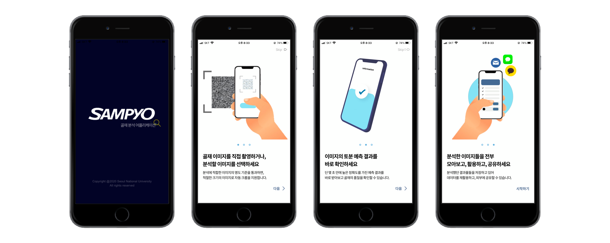

# 삼표, 골재 품질 진단 이미지 분석 어플리케이션 프로젝트 

> 딥러닝 네트워크 개발: 설형욱, 이재욱 
> 모바일 어플리케이션 Frontend, Backend, Design: 이재은 

> 본 어플리케이션은 Frontend React Native, Backend Django 를 써서 개발을 하였습니다. 

### 온보딩 Flow

> 어플리케이션 실행 시 뜨는 Splash 화면, 그리고 최초 실행 시 On boarding 화면들 

### 이미지 선택 및 촬영 

> 어플리케이션에 골재 이미지를 갤러리에서 선택, 혹은 직접 촬영해서 골재 품질 분석을 할 수 있습니다. 
> 이미지의 명도가 20이 넘어야 분석 결과의 신뢰도가 확보되므로, 사진 선택/ 촬영 후 즉시 이미지 명도에 대한 분석이 실행됩니다. 

### 이미지 전처리 및 결과 확보

> 명도 적합성 판단을 통과한 이미지는 알고리즘에 의해 골재 부분이 자동 크롭 됩니다. 하지만, 자동 크롭된 이미지가 정확하지 않은 경우에는
> 직접 이미지의 부분을 선택해서 크롭을 할 수 있습니다. 크롭 가능한 이미지의 크기는 1700x3000 혹은 3000x1700으로 정해져있습니다. 
> 적당한 크기로 크롭된 이미지를 서버에서 분석해서 결과를 즉시 확인할 수 있습니다. 

### 분석한 결과물들 모아보고, 관리하고, 공유 및 라벨링 기능 

> 얻은 결과물들은 모두 이 Archive에 저장이 됩니다. 각각의 결과를 다시 확인해보고, 라벨링하고, 공유, 삭제 할 수 있습니다. 

